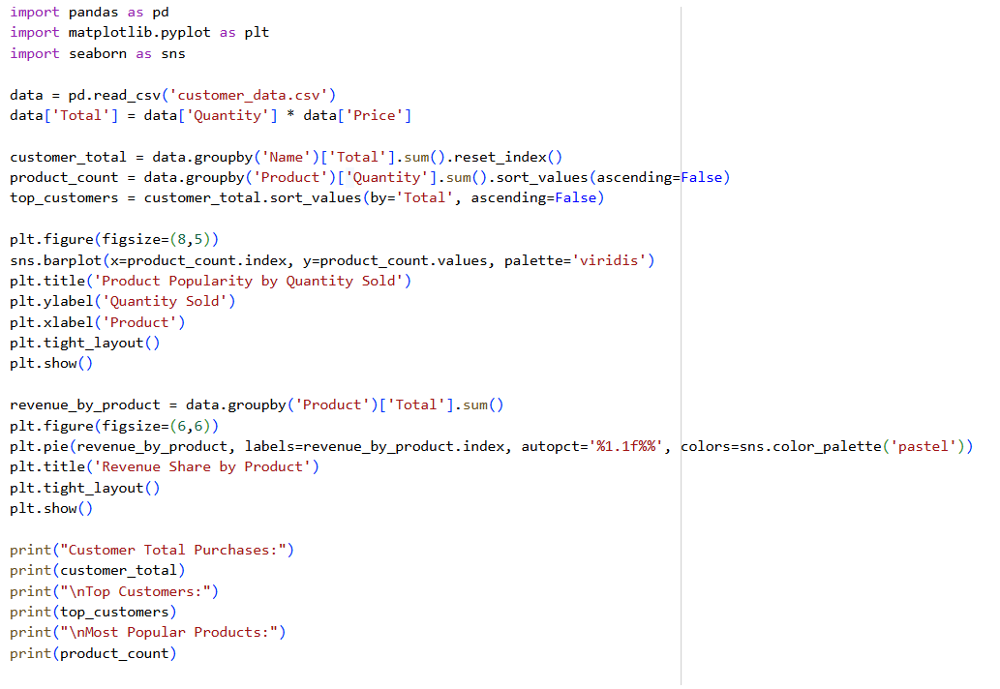
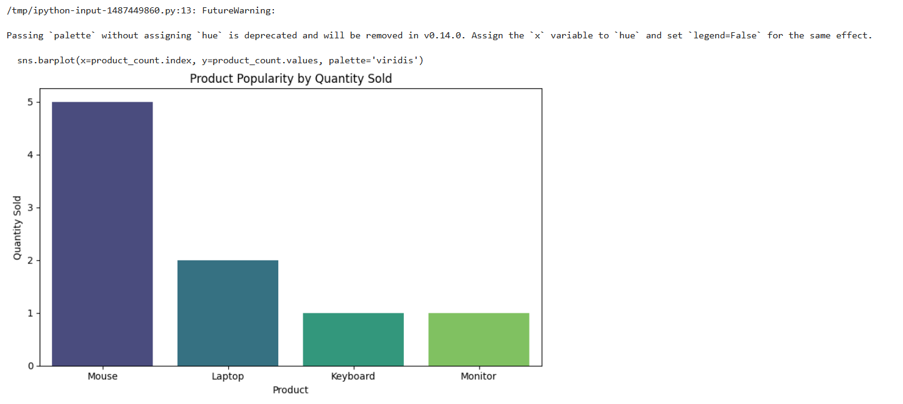
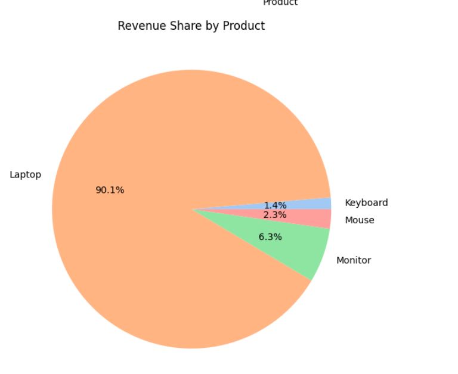

# customer-purchase-analysis-python
Analyze customer purchase behavior using Python to generate insights on sales trends, high-value customers, and product popularity. Project includes data cleaning, aggregation, and visualization using Pandas and Matplotlib.
# Customer Purchase Behavior Analysis

This project analyzes customer purchase data to generate actionable business insights. It demonstrates how to process, aggregate, and visualize data using Python, Pandas, and Matplotlib.

## Objective
The goal is to understand customer buying behavior, identify high-value customers, find popular products, and visualize revenue distribution. This project simulates real-world retail data analysis.

## Dataset
- `customer_data.csv` contains sample customer purchase data.
- Columns include:
  - CustomerID
  - Name
  - Product
  - Quantity
  - Price
  - Date

## Features
- Calculate total purchase per customer
- Identify high-value customers
- Determine the most popular products
- Visualize product popularity using bar chart
- Visualize revenue share using pie chart

## Technologies Used
- Python
- Pandas for data manipulation
- Matplotlib & Seaborn for visualization

## Screenshots
### Data Preview

### body of code

### Bar Chart – Product Popularity

### Pie Chart – Revenue Share

## How to Run
1. Open `customer_analysis.py` in Google Colab or any Python IDE.
2. Ensure `customer_data.csv` is in the same directory.
3. Run the script to view analysis and generate graphs.
